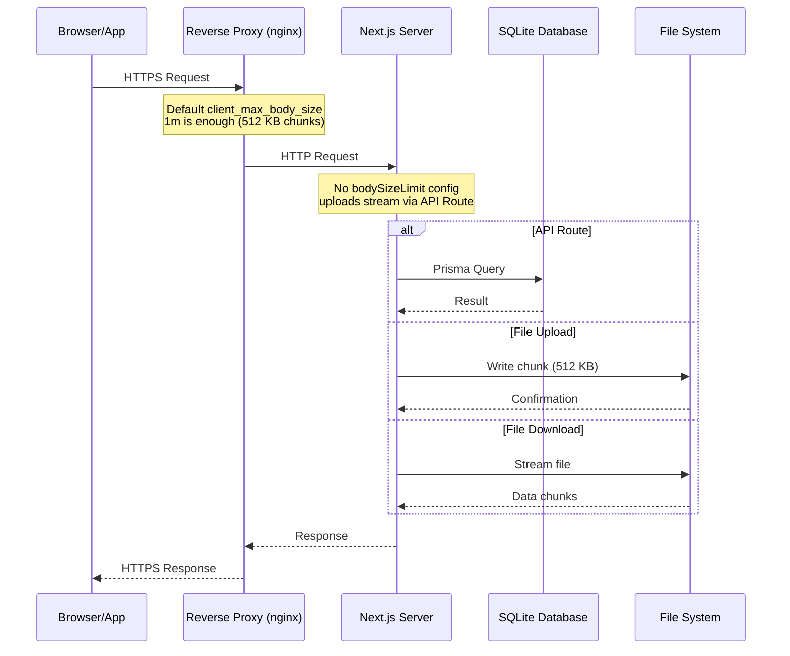

<div align="center">

# Advanced Configuration

> Understanding and tuning LinyaShare's configuration files.


</div>

---

## Navigation

| Document | Link |
|----------|------|
| Documentation Index | [docs/README.md](README.md) |
| Environment Variables | [ENVIRONMENT.md](ENVIRONMENT.md) |
| Docker Setup | [SETUP_DOCKER.md](SETUP_DOCKER.md) |

---

## Table of Contents

1. [next.config.js](#nextconfigjs)
2. [tailwind.config.ts](#tailwindconfigts)
3. [tsconfig.json](#tsconfigjson)
4. [postcss.config.js](#postcssconfigjs)
5. [Request Flow](#request-flow)
6. [Performance Tuning](#performance-tuning)

---

## next.config.js

```javascript
/** @type {import('next').NextConfig} */
const nextConfig = {
  output: 'standalone',
}

module.exports = nextConfig
```

### output: 'standalone'

| Attribute | Value |
|-----------|-------|
| Purpose | Creates a minimal production build |
| Effect | Only includes necessary files in `.next/standalone/` |
| Benefit | Smaller Docker images, faster deployments |

> [!NOTE]
> Without `standalone` mode, the entire `node_modules` would need to be present at runtime. Standalone mode copies only the required modules, reducing the Docker image from approximately 500MB to 150MB.

### No `bodySizeLimit` needed

| Attribute | Value |
|-----------|-------|
| Setting | Removed |
| Purpose | Was only relevant for Server Actions |
| Chunk size | 512 KB |

> [!NOTE]
> **File uploads use API Routes with chunked streaming**, not Server Actions. `experimental.serverActions.bodySizeLimit` was never applied to uploads, so it has been removed from `next.config.js`. The default Next.js `1mb` Server Action limit remains unchanged.

#### Why no config is needed

| Reason | Explanation |
|--------|-------------|
| 512 KB chunks | Each upload request is ~512 KB, well below the nginx default `client_max_body_size 1m` |
| No proxy tuning | nginx/Caddy/Traefik work out of the box, no `client_max_body_size` change required |
| Authenticated upload sessions | `/api/uploads/session` reserves quota; `/api/upload` accepts ordered chunks and `/api/upload/finalize` assembles them |
| Server Actions | Not used for uploads, so `bodySizeLimit` does not matter here |

#### Upload limits reference

| Component | Limit | LinyaShare |
|-----------|-------|------------|
| Next.js Server Action | `1mb` default | Not used for uploads |
| nginx `client_max_body_size` | `1m` default | 512 KB chunks fit without changes |
| Cloudflare (free) | 100 MB | Chunked uploads keep each request below this limit |

```bash
# Optional: only needed if you ever increase the chunk size (src/lib/constants.ts)
# nginx: client_max_body_size 100g; (for chunked API routes)
# Caddy: Not needed (unlimited by default)
# Traefik: Not needed (unlimited by default)
```

> [!TIP]
> The chunk size is defined once in `src/lib/constants.ts` (`CHUNK_SIZE`) and imported by the dashboard. Keep it below your reverse proxy's request body limit.

---

## tailwind.config.ts

```typescript
import type { Config } from "tailwindcss"

const config: Config = {
  content: [
    "./src/**/*.{js,ts,jsx,tsx,mdx}",
  ],
  theme: {
    extend: {
      colors: {
        dark: {
          50: '#f8fafc',
          100: '#f1f5f9',
          200: '#e2e8f0',
          300: '#cbd5e1',
          400: '#94a2b8',
          500: '#64748b',
          600: '#475569',
          700: '#1e1e2e',
          800: '#11111a',
          900: '#0a0a12',
        },
        primary: {
          400: '#ec4899',
          500: '#db2777',
          600: '#be185d',
        },
      },
    },
  },
  plugins: [],
}

export default config
```

### Custom Color Palette

| Color Class | Usage |
|------------|-------|
| `dark-700` | Card backgrounds, borders |
| `dark-800` | Page background |
| `dark-900` | Deepest background layer |
| `primary-400` | Accent color (pink) |
| `primary-500` | Hover states |

> [!NOTE]
> The `dark-*` and `primary-*` colors are used throughout the app via Tailwind classes like `bg-dark-800` and `text-primary-400`.

> [!TIP]
> Since v1.1 the `primary-*` palette is driven by CSS variables and can be changed at runtime from **Admin → Settings → Appearance** (no rebuild needed).

---

## Appearance / Theme Settings

The look of the instance (accent colors, background, header, fonts) is stored in the `Setting` table under the `theme.*` keys. Configure it from the **Appearance** tab in the admin settings (`/admin/settings`) — changes are previewed live and applied globally to all pages once saved.

| Key | Default | Description |
|------|---------|-------------|
| `theme.accentMode` | `single` | `single` (one color) or `gradient` (two colors + direction) |
| `theme.accentColor` | `#db2777` | Base accent color (single mode) |
| `theme.accentFrom` / `theme.accentTo` | `#ec4899` / `#db2777` | Gradient start/end colors |
| `theme.gradientDirection` | `135deg` | Gradient direction — adjustable via slider (0–360°) or `radial` |
| `theme.backgroundType` | `particles` | `particles` / `solid` / `gradient` / `none` |
| `theme.backgroundColor` | `#0a0a0f` | Background color (solid mode) |
| `theme.backgroundFrom` / `theme.backgroundTo` | `#0a0a0f` / `#11111a` | Background gradient colors |
| `theme.backgroundDirection` | `135deg` | Background gradient direction — slider or `radial` |
| `theme.headerSticky` | `true` | `true` = sticky header, `false` = normal |
| `theme.headerStyle` | `blur` | `blur` / `solid` / `transparent` |
| `theme.fontBody` | `Inter` | Body font (Google Fonts) |
| `theme.fontHeading` | `Orbitron` | Heading + logo font |

### How it works

- `src/lib/theme.ts` resolves the settings into a validated `ThemeConfig` (whitelisted colors, directions and fonts) and generates CSS variables (e.g. `--primary-500`, `--accent-gradient`, `--background-image`).
- `src/app/layout.tsx` reads the settings server-side and inlines a `:root` style block — no flash of the default theme.
- Tailwind's `primary-*` palette maps to those CSS variables, so a single change re-themes the whole app (buttons, links, icons, glows, particles, OG images).

### Advanced: colors and gradients

- **Simple color**: pick one accent color — the full shade ramp (50–900) is derived automatically.
- **Complex gradient**: enable gradient mode, choose `from`/`to` colors and a direction (including `radial`) for buttons, the logo gradient and accent glows.
- All values are sanitized: colors must be valid `#rrggbb` hex, directions come from a whitelist, fonts from a whitelist.

---

## tsconfig.json

| Setting | Purpose |
|---------|---------|
| `strict: true` | Full TypeScript strict mode |
| `@/*` path alias | Import from `@/components/...` instead of relative paths |
| `bundler` module resolution | Required for Next.js 15 |
| `incremental: true` | Faster subsequent builds |

---

## postcss.config.js

```javascript
module.exports = {
  plugins: {
    tailwindcss: {},
    autoprefixer: {},
  },
}
```

Standard PostCSS configuration for Tailwind CSS. No modifications needed.

---

## Request Flow



---

## Performance Tuning

### Memory

| Setting | Default | Tuning Notes |
|---------|---------|--------------|
| `bodySizeLimit` | Removed | Not needed, uploads use API Routes |
| Chunk size | 512 KB | Defined in `src/lib/constants.ts` |
| Max particles | 400 | Auto-scaled in `AnimatedBackground.tsx` |

### Database

| Setting | Default | Notes |
|---------|---------|-------|
| SQLite WAL mode | Off | Enable for better concurrent performance |
| Connection pool | 1 | SQLite does not benefit from pooling |

### Network

| Component | Setting | Recommendation |
|-----------|---------|---------------|
| nginx `client_max_body_size` | `1m` | No change needed (512 KB chunks fit below the default) |
| nginx `proxy_read_timeout` | `60s` | Set to `300s` for slow connections |
| Cloudflare | 100MB limit | Chunked uploads bypass this entirely |

---

<div align="center">

[Documentation Index](README.md) | [Environment Guide](ENVIRONMENT.md) | [Database Guide](DATABASE.md)

</div>
