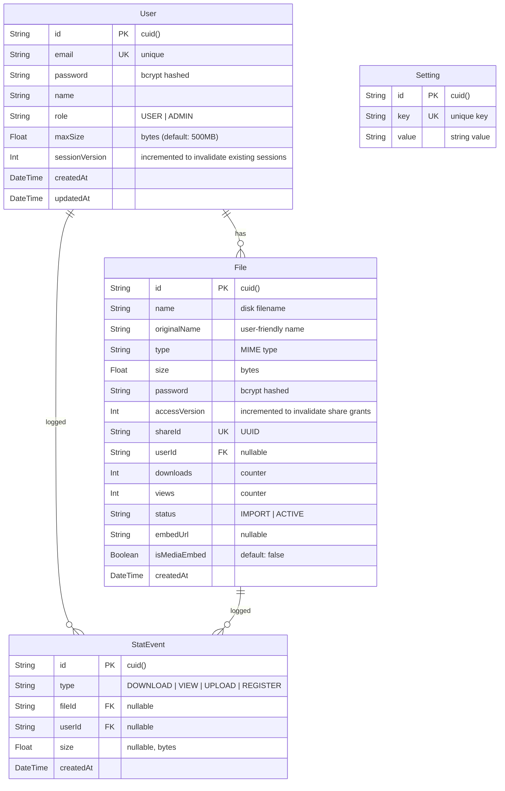
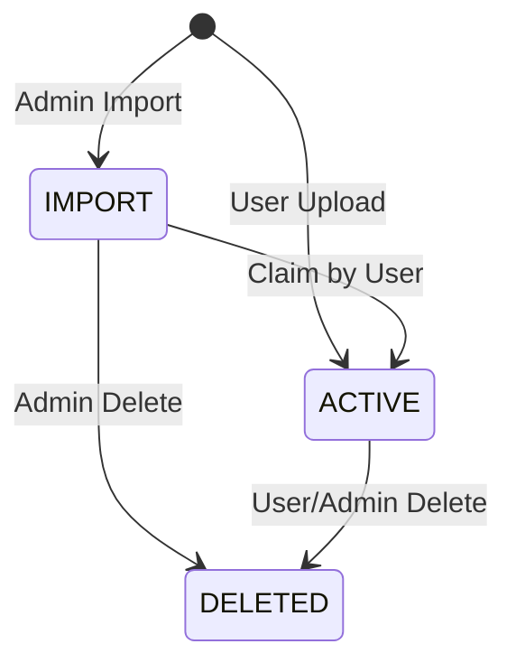

<div align="center">

# Database Guide

> Complete reference for LinyaShare's database schema and management.


</div>

---

## Navigation

| Document | Link |
|----------|------|
| Documentation Index | [docs/README.md](README.md) |
| Development Guide | [DEVELOPMENT.md](DEVELOPMENT.md) |
| Configuration Guide | [CONFIGURATION.md](CONFIGURATION.md) |

---

## Table of Contents

1. [Overview](#overview)
2. [Entity Relationship Diagram](#entity-relationship-diagram)
3. [Models](#models)
   - [User](#user)
   - [File](#file)
   - [Setting](#setting)
   - [StatEvent](#statevent)
4. [Status Workflow](#status-workflow)
5. [Database File Locations](#database-file-locations)
6. [Migrations](#migrations)
7. [Management](#management)

---

## Overview

LinyaShare uses **SQLite** via **Prisma ORM**. No external database server is needed -- the entire database is a single file.

> [!NOTE]
> SQLite was chosen for its simplicity. No PostgreSQL, MySQL, or Docker database containers are required. Perfect for self-hosted deployments.

### Database File Locations

| Environment | Path |
|-------------|------|
| Development | `prisma/linyashare.db` |
| Docker | `/app/prisma/linyashare.db` (inside container) |
| Pterodactyl | `/home/container/prisma/linyashare.db` |

---

## Entity Relationship Diagram



---

## Models

### User

The `User` model represents an account in the system.

| Field | Type | Description |
|-------|------|-------------|
| `id` | `cuid()` | Auto-generated unique identifier |
| `email` | `String @unique` | Login email (must be unique) |
| `password` | `String` | bcrypt-hashed password |
| `name` | `String` | Display name |
| `role` | `String` | `"USER"` or `"ADMIN"` |
| `maxSize` | `Float (bytes)` | Storage limit (default: 500MB) |
| `sessionVersion` | `Int` | Invalidates existing sessions after security-sensitive changes |
| `files` | `File[]` | Relation to uploaded files |
| `createdAt` | `DateTime` | Account creation timestamp |
| `updatedAt` | `DateTime` | Last update timestamp |

#### Roles

| Role | Permissions |
|------|-------------|
| `USER` | Upload files, manage own files, change own settings |
| `ADMIN` | All USER permissions + manage users, files, settings, imports |

> [!WARNING]
> The first registered user via the Setup Wizard is automatically assigned the `ADMIN` role. Subsequent registrations get `USER`.

#### Storage Limit

The `maxSize` field is in **bytes**. Conversion helpers:

| Operation | Formula |
|-----------|---------|
| MB to bytes | `mb * 1024 * 1024` |
| bytes to MB | `Math.round(bytes / (1024 * 1024))` |
| 500 MB default | `524288000` bytes |

---

### File

The `File` model represents an uploaded or imported file.

| Field | Type | Description |
|-------|------|-------------|
| `id` | `cuid()` | Auto-generated unique identifier |
| `name` | `String` | Sanitized filename on disk (UUID + ext) |
| `originalName` | `String` | Original filename from user |
| `type` | `String` | MIME type (`video/mp4`, `image/png`, etc.) |
| `size` | `Float` | File size in bytes |
| `password` | `String?` | bcrypt-hashed password (null = no password) |
| `accessVersion` | `Int` | Invalidates existing password-grant cookies after password changes |
| `shareId` | `String @unique` | UUID for share URLs (`/s/{shareId}`) |
| `userId` | `String?` | Owner's user ID (null = unclaimed) |
| `downloads` | `Int` | Download counter |
| `views` | `Int` | View counter (counted per `/s/` page view) |
| `status` | `String` | `"IMPORT"` or `"ACTIVE"` |
| `embedUrl` | `String?` | URL for media embed |
| `isMediaEmbed` | `Boolean` | Whether file has embeddable media |
| `createdAt` | `DateTime` | Upload timestamp |

> [!TIP]
> The `name` field is the sanitized disk filename (UUID + extension). The `originalName` is what users see. This separation prevents path traversal attacks.

Plaintext share passwords are not stored. New passwords are shown once when they are created or replaced; the database retains only the bcrypt hash.

---

### Setting

The `Setting` model is a key-value store for global configuration.

| Field | Type | Description |
|-------|------|-------------|
| `id` | `cuid()` | Auto-generated unique identifier |
| `key` | `String @unique` | Setting key |
| `value` | `String` | Setting value |

#### Available Settings

| Key | Type | Description | Default |
|-----|------|-------------|---------|
| `siteName` | string | Site title shown in header | `LinyaShare` |
| `allowRegistration` | string | Allow user self-registration | `true` |
| `maxUsers` | string (number) | Maximum user count (-1 = unlimited) | `-1` |
| `defaultMaxSize` | string (number) | Default storage limit in bytes | `524288000` |
| `supportEmail` | string | Support email shown on login/register | - |
| `discordUrl` | string | Discord invite link | - |
| `imprintUrl` | string | External imprint URL | - |
| `privacyContent` | string (markdown) | Privacy policy content | Default template |
| `tosContent` | string (markdown) | Terms of service content | Default template |

> [!NOTE]
> Settings are managed through the admin panel at `/admin/settings`. They can also be manipulated directly via Prisma Studio.

---

### StatEvent

The `StatEvent` model is a timestamped activity log that powers the admin statistics dashboard.

| Field | Type | Description |
|-------|------|-------------|
| `id` | `cuid()` | Auto-generated unique identifier |
| `type` | `String` | Event type: `DOWNLOAD`, `VIEW`, `UPLOAD` or `REGISTER` |
| `fileId` | `String?` | Related file (null for registrations), `onDelete: SetNull` |
| `userId` | `String?` | Related user (null for admin imports), `onDelete: SetNull` |
| `size` | `Float?` | File size in bytes (used for bandwidth stats) |
| `createdAt` | `DateTime` | Event timestamp |

#### Event Types

| Type | Trigger | Size logged |
|------|---------|-------------|
| `DOWNLOAD` | File downloaded via `/api/files/download` or `/api/files/stream?download=1` | Yes (file size) |
| `VIEW` | Share page `/s/{shareId}` viewed (password-protected files only after unlock) | Yes (file size) |
| `UPLOAD` | User upload or admin import finalized | Yes (file size) |
| `REGISTER` | Self-registration, admin-created user, or first Setup admin | No |

> [!NOTE]
> Events are written **fire-and-forget** — logging failures are silently ignored so they never block the upload/download hot path. The aggregate `downloads` / `views` counters remain independent and keep working even if the log is unavailable.

> [!IMPORTANT]
> The event log starts collecting **after** deployment. Historical aggregated counters cannot be reconstructed — "last 30 days" figures therefore start at 0.

> [!TIP]
> For SQLite, the stat events are queried per period and bucketed in memory. This is fine for self-hosted scale; for very high traffic consider periodic cleanup of old `StatEvent` rows.

---

## Status Workflow



| Status | Meaning | Location | Owner |
|--------|---------|----------|-------|
| `IMPORT` | Admin-uploaded, not yet claimed | `/data/import/` | None |
| `ACTIVE` | User-uploaded or claimed | `/data/uploads/` | User assigned |
| `ORPHANED` | On disk only, no DB record | `/data/import/` | None |

---

## Migrations

### Development (db push)

```bash
# After changing prisma/schema.prisma:
npm run db:push       # Apply changes directly
npm run db:generate   # Regenerate TypeScript client
```

> [!WARNING]
> `db push` is best for development. In production, consider using `prisma migrate` for version-controlled migrations.

### Production (prisma migrate)

```bash
# Create a migration
npx prisma migrate dev --name add_new_field

# Apply migrations in production
npx prisma migrate deploy
```

### Reset Database

```bash
# Delete the SQLite file
rm prisma/linyashare.db

# Regenerate
npm run db:push
```

> [!CAUTION]
> Resetting the database deletes all users, files, and settings. Back up the database file first if needed:
> ```bash
> cp prisma/linyashare.db prisma/linyashare.db.backup
> ```

---

## Management

### Prisma Studio

```bash
npm run db:studio
```

Opens a web-based GUI at `http://localhost:5555` for:

| Action | Description |
|--------|-------------|
| Browse tables | View all records in User, File, Setting, StatEvent |
| Edit records | Modify data directly |
| Create test data | Add users or files for testing |
| Debug issues | Inspect relationships and values |

### Direct SQL Access

```bash
# Using sqlite3 CLI
sqlite3 prisma/linyashare.db

# Common queries
.tables                    # List all tables
SELECT * FROM User;        # View all users
SELECT * FROM File;        # View all files
SELECT * FROM Setting;     # View all settings
SELECT * FROM StatEvent;   # View all stat events
SELECT type, COUNT(*) FROM StatEvent GROUP BY type;  # Event totals per type
```

### Backup

```bash
# Simple file copy
cp prisma/linyashare.db prisma/linyashare.db.$(date +%Y%m%d).backup

# Or use .dump for portable backup
sqlite3 prisma/linyashare.db .dump > backup.sql
```

---

<div align="center">

[Documentation Index](README.md) | [Development Guide](DEVELOPMENT.md) | [Docker Setup](SETUP_DOCKER.md)

</div>
