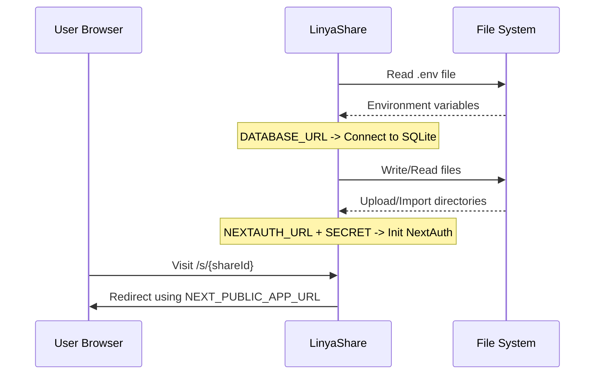

<div align="center">

# Environment Variables

> Complete reference for all LinyaShare environment variables.


</div>

---

## Navigation

| Document | Link |
|----------|------|
| Documentation Index | [docs/README.md](README.md) |
| Development Guide | [DEVELOPMENT.md](DEVELOPMENT.md) |
| Configuration Guide | [CONFIGURATION.md](CONFIGURATION.md) |

---

## Table of Contents

1. [Overview](#overview)
2. [Required Variables](#required-variables)
3. [Optional Variables](#optional-variables)
4. [Generating Secrets](#generating-secrets)
5. [Configuration Flow](#configuration-flow)
6. [.env File Guide](#env-file-guide)
7. [Troubleshooting](#troubleshooting)

---

## Overview

| Variable | Required | Default | Description |
|----------|----------|---------|-------------|
| `DATABASE_URL` | Yes | `file:./linyashare.db` | SQLite database connection |
| `NEXTAUTH_SECRET` | Yes | - | JWT encryption key |
| `NEXTAUTH_URL` | Yes | `http://localhost:3000` | Full instance URL |
| `NEXT_PUBLIC_APP_URL` | Yes | `http://localhost:3000` | Public URL for share links |
| `UPLOAD_DIR` | No | `data/uploads` | Upload storage path |
| `IMPORT_DIR` | No | `data/import` | Import storage path |
| `PORT` | No | `3000` | Application port |
| `HOSTNAME` | No | `localhost` | Bind address |

---

## Required Variables

> [!CAUTION]
> The following variables must be set for the application to work.

### DATABASE_URL

| Attribute | Value |
|-----------|-------|
| Required | Yes |
| Default | `file:./linyashare.db` |
| Type | SQLite connection string |

```env
DATABASE_URL="file:./linyashare.db"
```

> [!NOTE]
> LinyaShare uses SQLite by default. No external database server is needed. The file path is relative to the project root.

### NEXTAUTH_SECRET

| Attribute | Value |
|-----------|-------|
| Required | Yes |
| Default | None |
| Type | Base64-encoded random string |

```env
# Generate with: openssl rand -base64 32
NEXTAUTH_SECRET="<generated random value>"
```

Used to encrypt JWT tokens and session cookies. **Must be kept secret.**

### NEXTAUTH_URL

| Attribute | Value |
|-----------|-------|
| Required | Yes |
| Default | `http://localhost:3000` |
| Type | Full URL |

```env
NEXTAUTH_URL="http://localhost:3000"
```

Full URL of your LinyaShare instance. Used by NextAuth for callback URLs.

### NEXT_PUBLIC_APP_URL

| Attribute | Value |
|-----------|-------|
| Required | Yes |
| Default | `http://localhost:3000` |
| Type | Full public URL |

```env
NEXT_PUBLIC_APP_URL="http://localhost:3000"
```

> [!WARNING]
> This variable is used to generate share links, embed URLs, and Open Graph tags. If set incorrectly, shared links will point to the wrong address.

---

## Optional Variables

### UPLOAD_DIR

| Attribute | Value |
|-----------|-------|
| Required | No |
| Default | `data/uploads` |
| Type | Path (absolute or relative) |

```env
UPLOAD_DIR="data/uploads"
```

Directory where user-uploaded files are stored.

| Path Type | Example | Behavior |
|-----------|---------|----------|
| Absolute | `/data/uploads` | Used directly |
| Relative | `data/uploads` | Resolved relative to project root |

### IMPORT_DIR

| Attribute | Value |
|-----------|-------|
| Required | No |
| Default | `data/import` |
| Type | Path (absolute or relative) |

```env
IMPORT_DIR="data/import"
```

Directory where admin-imported files are stored before being claimed by users.

### PORT

| Attribute | Value |
|-----------|-------|
| Required | No |
| Default | `3000` |
| Type | Number (1-65535) |

```env
PORT=3000
```

The port the application listens on.

> [!TIP]
> On Pterodactyl/FeatherPanel the egg sets `PORT` automatically from the server allocation (via `SERVER_PORT` with a `{{SERVER_PORT}}` fallback), so you never need to configure it there.

### HOSTNAME

| Attribute | Value |
|-----------|-------|
| Required | No |
| Default | `localhost` |
| Type | Hostname or IP |

```env
HOSTNAME="0.0.0.0"
```

| Value | Effect |
|-------|--------|
| `localhost` | Local access only |
| `0.0.0.0` | Network accessible |
| `127.0.0.1` | Localhost only (recommended with reverse proxy) |

---

## Generating Secrets

| Method | Command |
|--------|---------|
| OpenSSL (recommended) | `openssl rand -base64 32` |
| Node.js | `node -e "console.log(require('crypto').randomBytes(32).toString('base64'))"` |

> [!WARNING]
> Do not use the same `NEXTAUTH_SECRET` across multiple instances. Each instance needs its own unique secret.

---

## Configuration Flow



---

## .env File Guide

### Development (.env)

```env
DATABASE_URL="file:./linyashare.db"
# Generate with: openssl rand -base64 32
NEXTAUTH_SECRET="<generated random value>"
NEXTAUTH_URL="http://localhost:3000"
NEXT_PUBLIC_APP_URL="http://localhost:3000"
UPLOAD_DIR="data/uploads"
IMPORT_DIR="data/import"
```

### Production (.env)

```env
DATABASE_URL="file:./linyashare.db"
# Generate with: openssl rand -base64 32
NEXTAUTH_SECRET="<generated random value>"
NEXTAUTH_URL="https://share.example.com"
NEXT_PUBLIC_APP_URL="https://share.example.com"
UPLOAD_DIR="/var/data/linyashare/uploads"
IMPORT_DIR="/var/data/linyashare/import"
```

> [!TIP]
> For production, use absolute paths for `UPLOAD_DIR` and `IMPORT_DIR` to ensure they work regardless of where the app is started from.

### .env vs .env.example

| File | Purpose | Git |
|------|---------|-----|
| `.env` | Your actual configuration (contains secrets) | Ignored |
| `.env.example` | Template with placeholder values | Tracked |

```bash
# Initial setup
cp .env.example .env
# Then edit .env with your real values
```

---

## Troubleshooting

| Symptom | Cause | Solution |
|---------|-------|----------|
| `NEXTAUTH_URL not set` | Missing env variable | Add `NEXTAUTH_URL` to `.env` |
| `Invalid secret` | Weak or empty `NEXTAUTH_SECRET` | Generate a proper secret |
| Share links point to localhost | Wrong `NEXT_PUBLIC_APP_URL` | Update with public URL |
| Upload directory error | Wrong `UPLOAD_DIR` path | Use absolute path in production |
| Port conflict | PORT already in use | Change PORT or stop other service |

### Docker Environment

When using Docker, set environment variables in `docker-compose.yml`:

```yaml
services:
  linyashare:
    environment:
      - NEXTAUTH_SECRET=${NEXTAUTH_SECRET}
      - NEXTAUTH_URL=${NEXTAUTH_URL}
      - NEXT_PUBLIC_APP_URL=${NEXT_PUBLIC_APP_URL}
```

---

<div align="center">

[Documentation Index](README.md) | [Configuration Guide](CONFIGURATION.md) | [Docker Setup](SETUP_DOCKER.md)

</div>
