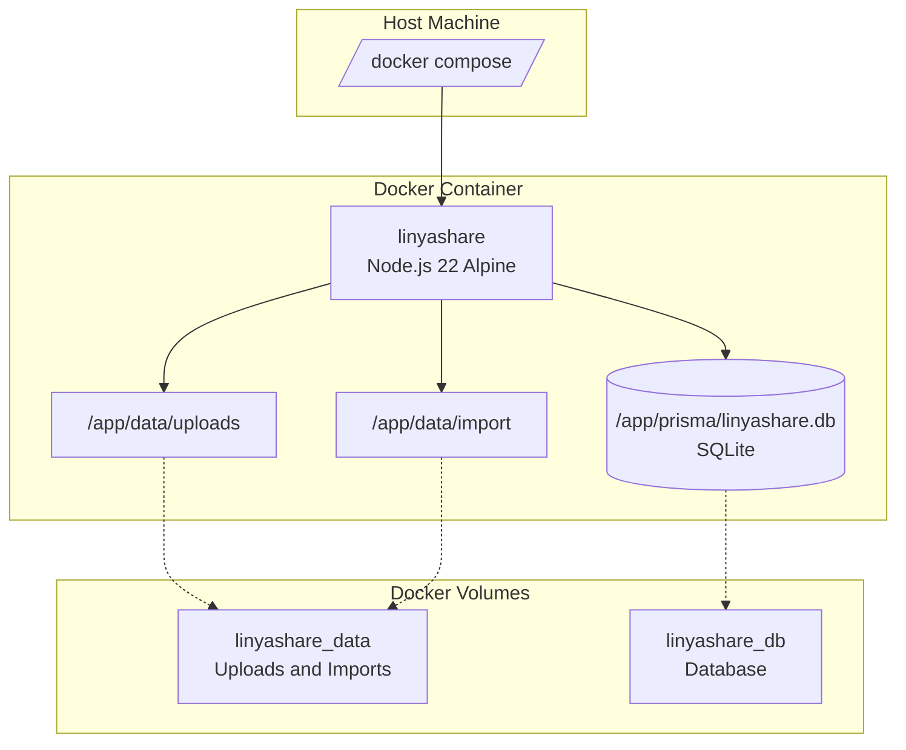

<div align="center">

# Docker Deployment Guide

> Deploy LinyaShare using Docker and Docker Compose.


</div>

---

## Navigation

| Document | Link |
|----------|------|
| Documentation Index | [docs/README.md](README.md) |
| Environment Variables | [ENVIRONMENT.md](ENVIRONMENT.md) |
| Node.js Setup | [SETUP_NODEJS.md](SETUP_NODEJS.md) |

---

## Table of Contents

1. [Prerequisites](#prerequisites)
2. [Quick Start](#quick-start)
3. [Architecture](#architecture)
4. [Dockerfile Explained](#dockerfile-explained)
5. [Docker Compose Explained](#docker-compose-explained)
6. [Production Deployment](#production-deployment)
7. [Commands Reference](#commands-reference)
8. [Troubleshooting](#troubleshooting)

---

## Prerequisites

| Tool | Minimum Version | Check Command |
|------|----------------|---------------|
| Docker Engine | 24+ | `docker --version` |
| Docker Compose | v2 | `docker compose version` |

> [!WARNING]
> Docker Compose v1 (`docker-compose`) is deprecated. Use v2 (`docker compose`) which is now integrated into Docker Engine.

---

## Quick Start

```bash
# 1. Clone the repository
git clone https://github.com/LinyaVT/LinyaShare.git
cd LinyaShare

# 2. Build and start
docker compose up -d

# 3. Check logs
docker compose logs -f

# 4. Open http://localhost:3000
```

> [!TIP]
> On first visit, you will be guided through the admin account setup wizard. Complete this to start using LinyaShare.

---

## Architecture



### Volume Mounts

| Volume | Container Path | Purpose |
|--------|---------------|---------|
| `linyashare_data` | `/app/data` | Uploaded and imported files |
| `linyashare_db` | `/app/prisma` | SQLite database file |

> [!NOTE]
> Using named volumes instead of bind mounts provides better performance on Docker Desktop (macOS/Windows) and ensures proper file permissions.

---

## Dockerfile Explained

### Multi-Stage Build

The Dockerfile uses two stages:

| Stage | Base Image | Purpose |
|-------|-----------|---------|
| `builder` | `node:22-alpine` | Install deps, generate Prisma, build Next.js |
| `runner` | `node:22-alpine` | Runtime with minimal footprint |

> [!IMPORTANT]
> Multi-stage builds reduce the final image from approximately 1.2GB to 150MB by only copying the built artifacts.

### Builder Stage

```dockerfile
FROM node:22-alpine AS builder
WORKDIR /app
COPY package.json package-lock.json ./
RUN npm ci
COPY . .
RUN npx prisma generate
RUN npm run build
```

> [!NOTE]
> `npm ci` (clean install) is used instead of `npm install` for deterministic builds. It respects `package-lock.json` exactly.

### Runner Stage

```dockerfile
FROM node:22-alpine AS runner
WORKDIR /app
RUN apk add --no-cache curl

RUN addgroup --system --gid 1001 nodejs && \
    adduser --system --uid 1001 nextjs

COPY --from=builder /app/.next/standalone ./
COPY --from=builder /app/.next/static ./.next/static
COPY --from=builder /app/public ./public
COPY --from=builder /app/prisma ./prisma
COPY --from=builder /app/node_modules/.prisma ./node_modules/.prisma

USER nextjs
```

> [!CAUTION]
> The container runs as non-root user (`nextjs`) for security. Volumes must be writable by UID 1001.

### Health Check

```dockerfile
HEALTHCHECK --interval=30s --timeout=5s --start-period=60s --retries=3 \
    CMD curl -f http://localhost:3000/api/setup || exit 1
```

| Parameter | Value | Description |
|-----------|-------|-------------|
| `interval` | 30s | Check every 30 seconds |
| `timeout` | 5s | Max wait for response |
| `start-period` | 60s | Grace period before first check |
| `retries` | 3 | Fail after 3 consecutive failures |

---

## Docker Compose Explained

```yaml
services:
  linyashare:
    build:
      context: .
      dockerfile: Dockerfile
    container_name: linyashare
    restart: unless-stopped
    ports:
      - "127.0.0.1:3000:3000"
```

### Port Mapping

| Host | Container | Description |
|------|-----------|-------------|
| `127.0.0.1:3000` | `3000` | Application HTTP (local host only) |

> [!TIP]
> Change the host port if 3000 is already in use:
> ```yaml
> ports:
>   - "8080:3000"
> ```

### Environment Variables

```yaml
environment:
  - DATABASE_URL=file:/app/data/linyashare.db
  - NEXTAUTH_SECRET=${NEXTAUTH_SECRET:?NEXTAUTH_SECRET must be set}
  - NEXTAUTH_URL=${NEXTAUTH_URL:-http://localhost:3000}
  - NEXT_PUBLIC_APP_URL=${NEXT_PUBLIC_APP_URL:-http://localhost:3000}
  - UPLOAD_DIR=data/uploads
  - IMPORT_DIR=data/import
  - NODE_ENV=production
  - PORT=3000
  - HOSTNAME=0.0.0.0
  - MAX_UPLOAD_SIZE_BYTES=${MAX_UPLOAD_SIZE_BYTES:-5368709120}
  - TRUSTED_PROXY=false
```

> [!WARNING]
> Always set a unique, random `NEXTAUTH_SECRET` via a `.env` file or environment variable. There is no insecure fallback value.

The default port binding is local-only. If a reverse proxy should reach the container, use the proxy network or bind only to the trusted proxy address.

### Environment File

Create a `.env` file in the project root:

```env
# Generate with: openssl rand -base64 32
NEXTAUTH_SECRET=<paste-generated-value-here>
NEXTAUTH_URL=https://share.example.com
NEXT_PUBLIC_APP_URL=https://share.example.com
```

---

## Production Deployment

### Basic Production Setup

```bash
# 1. Create .env with production values
cat > .env << EOF
NEXTAUTH_SECRET=$(openssl rand -base64 32)
NEXTAUTH_URL=https://share.example.com
NEXT_PUBLIC_APP_URL=https://share.example.com
EOF

# 2. Build and start
docker compose up -d --build

# 3. Verify
docker compose ps
curl http://localhost:3000/api/setup
```

### With Reverse Proxy (Recommended)

```yaml
# docker-compose.override.yml
services:
  linyashare:
    networks:
      - proxy

networks:
  proxy:
    external: true
```

> [!TIP]
> For production, run LinyaShare behind a reverse proxy (nginx, Caddy, Traefik) to handle SSL termination and domain routing.

### Full docker-compose.override.yml

```yaml
services:
  linyashare:
    environment:
      - NEXTAUTH_SECRET=${NEXTAUTH_SECRET:?NEXTAUTH_SECRET must be set}
      - NEXTAUTH_URL=https://share.example.com
      - NEXT_PUBLIC_APP_URL=https://share.example.com
    ports:
      - "127.0.0.1:3000:3000"
    restart: always
    logging:
      driver: "json-file"
      options:
        max-size: "10m"
        max-file: "3"
```

---

## Commands Reference

| Command | Description |
|---------|-------------|
| `docker compose up -d` | Start in background |
| `docker compose down` | Stop and remove containers |
| `docker compose restart` | Restart container |
| `docker compose ps` | Show container status |
| `docker compose build` | Build (or rebuild) images |
| `docker compose build --no-cache` | Fresh build without cache |
| `docker compose up -d --build` | Rebuild and start |
| `docker compose logs -f` | Follow logs |
| `docker compose logs linyashare` | Logs for specific service |
| `docker compose logs --tail=100` | Last 100 lines |
| `docker compose exec linyashare sh` | Shell into container |
| `docker system prune -a` | Clean up unused images |

---

## Troubleshooting

| Symptom | Cause | Solution |
|---------|-------|----------|
| `port already allocated` | Port 3000 in use | Change host port in `ports` |
| `permission denied` | Volume permissions | Run `chown -R 1001:1001 ./data` |
| `secret missing` | No NEXTAUTH_SECRET | Add to `.env` file |
| `database error` | DB file permissions | Check volume ownership |

### Reset Everything

```bash
# Stop and remove everything
docker compose down -v

# Rebuild from scratch
docker compose build --no-cache
docker compose up -d
```

> [!CAUTION]
> `docker compose down -v` deletes all volumes, including your database and uploaded files.

### Production Checklist

| Step | Description |
|------|-------------|
| 1 | Set a strong `NEXTAUTH_SECRET` |
| 2 | Configure `NEXT_PUBLIC_APP_URL` with your domain |
| 3 | Use a reverse proxy with SSL |
| 4 | Restrict port to `127.0.0.1` behind proxy |
| 5 | Set up regular database backups |
| 6 | Configure log rotation |
| 7 | Monitor container health |

---

<div align="center">

[Documentation Index](README.md) | [Pterodactyl Setup](SETUP_PTERODACTYL.md) | [Node.js Setup](SETUP_NODEJS.md)

</div>
