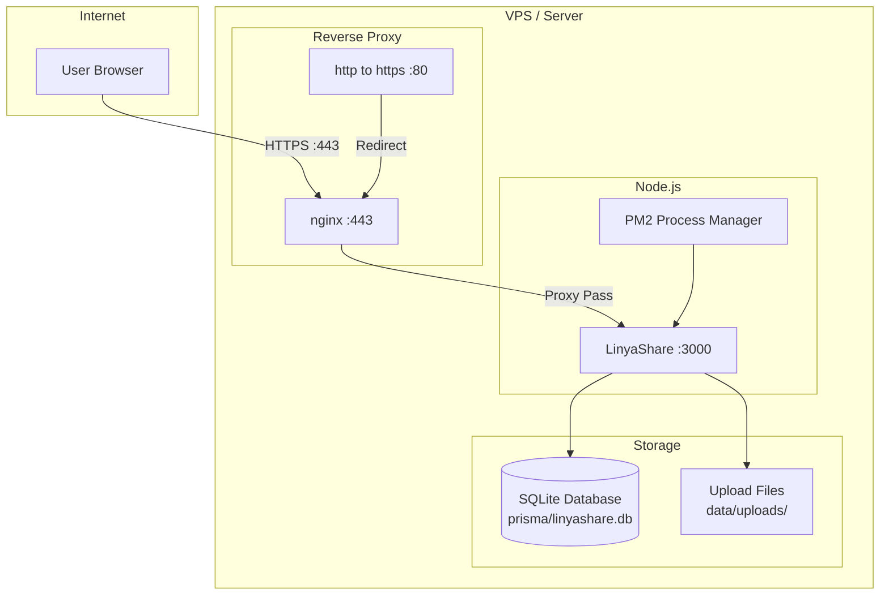

<div align="center">

# Node.js Production Setup

> Deploy LinyaShare on a bare-metal or VPS server with Node.js.


</div>

---

## Navigation

| Document | Link |
|----------|------|
| Documentation Index | [docs/README.md](README.md) |
| Docker Setup | [SETUP_DOCKER.md](SETUP_DOCKER.md) |
| Architecture | [ARCHITECTURE.md](ARCHITECTURE.md) |

---

## Table of Contents

1. [Prerequisites](#prerequisites)
2. [Quick Start](#quick-start)
3. [Architecture](#architecture)
4. [Step-by-Step Setup](#step-by-step-setup)
5. [Reverse Proxy Configuration](#reverse-proxy-configuration)
6. [Process Management](#process-management)
7. [SSL with Let's Encrypt](#ssl-with-lets-encrypt)
8. [Health Checks](#health-checks)
9. [Troubleshooting](#troubleshooting)

---

## Prerequisites

| Tool | Version | Check Command |
|------|---------|--------------|
| Node.js | 22+ | `node --version` |
| npm | 10+ | `npm --version` |
| Git | Any | `git --version` |
| nginx | 1.24+ (recommended) | `nginx -v` |
| PM2 | 5+ (recommended) | `pm2 --version` |

> [!WARNING]
> A reverse proxy (nginx, Caddy, Traefik) is strongly recommended for production to handle SSL, domain routing, and security headers.

---

## Quick Start

```bash
# 1. Clone and install
git clone https://github.com/LinyaVT/LinyaShare.git
cd LinyaShare
npm ci --production
cp .env.example .env

# 2. Edit .env with your settings
nano .env

# 3. Setup and build
npm run setup
npm run build

# 4. Start
npm start
```

---

## Architecture



---

## Step-by-Step Setup

### 1. System Update

```bash
# Debian/Ubuntu
apt update && apt upgrade -y

# Install Node.js 22
curl -fsSL https://deb.nodesource.com/setup_22.x | bash -
apt install -y nodejs git nginx
```

### 2. Clone Repository

```bash
# Create app directory
mkdir -p /var/www/linyashare
cd /var/www/linyashare

# Clone
git clone https://github.com/LinyaVT/LinyaShare.git .
```

### 3. Configure Environment

```bash
# Copy env template
cp .env.example .env

# Generate a secure secret
SECRET=$(openssl rand -base64 32)
echo "NEXTAUTH_SECRET=$SECRET" >> .env

# Edit .env
nano .env
```

**Production .env example:**

```env
DATABASE_URL="file:./linyashare.db"
# Generate with: openssl rand -base64 32
NEXTAUTH_SECRET="<generated random value>"
NEXTAUTH_URL="https://share.example.com"
NEXT_PUBLIC_APP_URL="https://share.example.com"
UPLOAD_DIR="/var/www/linyashare/data/uploads"
IMPORT_DIR="/var/www/linyashare/data/import"
PORT=3000
HOSTNAME=127.0.0.1
```

> [!CAUTION]
> Set `HOSTNAME=127.0.0.1` so the app only listens on localhost. The reverse proxy will handle external access.

### 4. Install Dependencies

```bash
# Clean install (production only)
npm ci --production

# Generate Prisma client
npx prisma generate
```

### 5. Create Database

```bash
npx prisma db push
```

### 6. Build Application

```bash
npm run build
```

> [!TIP]
> The build step may take 1-3 minutes depending on server resources. It creates the `.next/standalone/` directory.

### 7. Create Data Directories

```bash
mkdir -p data/uploads data/import
chmod 755 data/uploads data/import
```

### 8. Test Run

```bash
# Quick test
node .next/standalone/server.js &

# Visit http://your-server-ip:3000
# Complete the admin setup wizard
# Then stop the test server
kill %1
```

---

## Reverse Proxy Configuration

### nginx Configuration

Create `/etc/nginx/sites-available/linyashare`:

```nginx
server {
    listen 80;
    server_name share.example.com;
    
    # Redirect HTTP to HTTPS
    return 301 https://$host$request_uri;
}

server {
    listen 443 ssl http2;
    server_name share.example.com;

    # SSL certificates (see SSL section)
    ssl_certificate /etc/letsencrypt/live/share.example.com/fullchain.pem;
    ssl_certificate_key /etc/letsencrypt/live/share.example.com/privkey.pem;
    ssl_protocols TLSv1.2 TLSv1.3;
    ssl_ciphers HIGH:!aNULL:!MD5;

    # Large file uploads (optional: 512 KB chunks fit below the 1m default,
    # only needed if you increase CHUNK_SIZE in src/lib/constants.ts)
    client_max_body_size 100g;
    proxy_connect_timeout 300;
    proxy_send_timeout 300;
    proxy_read_timeout 300;

    # Security Headers
    add_header X-Frame-Options "SAMEORIGIN" always;
    add_header X-Content-Type-Options "nosniff" always;
    add_header X-XSS-Protection "1; mode=block" always;
    add_header Referrer-Policy "strict-origin-when-cross-origin" always;

    # Proxy Configuration
    location / {
        proxy_pass http://127.0.0.1:3000;
        proxy_http_version 1.1;
        proxy_set_header Upgrade $http_upgrade;
        proxy_set_header Connection 'upgrade';
        proxy_set_header Host $host;
        proxy_set_header X-Real-IP $remote_addr;
        proxy_set_header X-Forwarded-For $proxy_add_x_forwarded_for;
        proxy_set_header X-Forwarded-Proto $scheme;
        proxy_cache_bypass $http_upgrade;

        # Increase buffer for large requests
        proxy_buffer_size 128k;
        proxy_buffers 4 256k;
        proxy_busy_buffers_size 256k;
    }
}
```

Enable the site:

```bash
# Enable
ln -s /etc/nginx/sites-available/linyashare /etc/nginx/sites-enabled/
nginx -t  # Test configuration
systemctl reload nginx
```

### Caddy Configuration

```caddyfile
share.example.com {
    reverse_proxy 127.0.0.1:3000
    
    # Caddy handles SSL automatically
    
    header {
        X-Frame-Options "SAMEORIGIN"
        X-Content-Type-Options "nosniff"
    }
}
```

### Traefik Configuration

```yaml
# docker-compose.yml (if using Traefik with Docker)
services:
  linyashare:
    labels:
      - "traefik.enable=true"
      - "traefik.http.routers.linyashare.rule=Host(`share.example.com`)"
      - "traefik.http.routers.linyashare.entrypoints=websecure"
      - "traefik.http.routers.linyashare.tls.certresolver=letsencrypt"
```

---

## Process Management

### Using PM2 (recommended)

```bash
# Install PM2 globally
npm install -g pm2

# Start LinyaShare
pm2 start .next/standalone/server.js --name linyashare

# Save PM2 config
pm2 save

# Setup auto-start on reboot
pm2 startup
```

| PM2 Command | Description |
|-------------|-------------|
| `pm2 status` | Show all processes |
| `pm2 logs linyashare` | View logs |
| `pm2 restart linyashare` | Restart |
| `pm2 stop linyashare` | Stop |
| `pm2 delete linyashare` | Remove from PM2 |
| `pm2 monit` | Monitor CPU/memory |

#### PM2 Ecosystem File

Create `ecosystem.config.js`:

```javascript
module.exports = {
  apps: [{
    name: 'linyashare',
    script: '.next/standalone/server.js',
    env: {
      NODE_ENV: 'production',
      PORT: 3000,
      HOSTNAME: '127.0.0.1',
    },
    instances: 1,              // Single instance for SQLite
    exec_mode: 'fork',
    watch: false,
    max_memory_restart: '2G',  // Restart if memory > 2GB
    error_file: 'logs/err.log',
    out_file: 'logs/out.log',
    merge_logs: true,
    log_date_format: 'YYYY-MM-DD HH:mm:ss',
  }]
};
```

```bash
# Start with ecosystem file
pm2 start ecosystem.config.js
```

### Using systemd

Create `/etc/systemd/system/linyashare.service`:

```ini
[Unit]
Description=LinyaShare - Secure File Sharing
After=network.target

[Service]
Type=simple
User=www-data
WorkingDirectory=/var/www/linyashare
Environment=NODE_ENV=production
Environment=PORT=3000
Environment=HOSTNAME=127.0.0.1
ExecStart=/usr/bin/node /var/www/linyashare/.next/standalone/server.js
Restart=always
RestartSec=10

# Security
NoNewPrivileges=true
ProtectSystem=full
ProtectHome=true

[Install]
WantedBy=multi-user.target
```

```bash
systemctl daemon-reload
systemctl enable linyashare
systemctl start linyashare
systemctl status linyashare
```

---

## SSL with Let's Encrypt

### Using Certbot

```bash
# Install certbot
apt install -y certbot python3-certbot-nginx

# Get certificate
certbot --nginx -d share.example.com

# Auto-renewal (usually enabled by default)
certbot renew --dry-run
```

### Manual Certificate

```bash
certbot certonly --standalone -d share.example.com
```

| File | Location |
|------|----------|
| Certificate | `/etc/letsencrypt/live/share.example.com/fullchain.pem` |
| Private Key | `/etc/letsencrypt/live/share.example.com/privkey.pem` |

> [!TIP]
> Certbot with the nginx plugin automatically modifies your nginx config. The cert renewal is automatic via systemd timer.

---

## Health Checks

### Manual Check

```bash
curl -f http://localhost:3000/api/setup
# Returns: {"needsSetup": true} or {"needsSetup": false}
```

### Monitoring Script

Create `/usr/local/bin/check-linyashare.sh`:

```bash
#!/bin/bash
URL="http://localhost:3000/api/setup"

if curl -sf $URL > /dev/null 2>&1; then
    echo "LinyaShare is healthy"
    exit 0
else
    echo "LinyaShare is DOWN!"
    systemctl restart linyashare
    exit 1
fi
```

```bash
# Make executable and add to cron
chmod +x /usr/local/bin/check-linyashare.sh
echo "*/5 * * * * /usr/local/bin/check-linyashare.sh" | crontab -
```

---

## Troubleshooting

| Symptom | Cause | Solution |
|---------|-------|----------|
| `502 Bad Gateway` | App not running | Check `pm2 status` or `systemctl status` |
| `413 Request Entity Too Large` | nginx limit too low | Increase `client_max_body_size` (not needed with the default 512 KB chunks) |
| `Cannot find module` | Missing dependencies | Run `npm ci --production` |
| `Port 3000 in use` | Another process | `kill $(lsof -ti:3000)` |
| `Connection refused` | App not listening | Check `HOSTNAME` and `PORT` |
| `SSL certificate error` | Cert expired | Run `certbot renew` |

### Logs

| Command | Description |
|---------|-------------|
| `pm2 logs linyashare` | PM2 logs |
| `journalctl -u linyashare -f` | systemd logs |
| `tail -f /var/log/nginx/access.log` | nginx access logs |
| `tail -f /var/log/nginx/error.log` | nginx error logs |

### Backup Script

Create `/usr/local/bin/backup-linyashare.sh`:

```bash
#!/bin/bash
BACKUP_DIR="/var/backups/linyashare"
DATE=$(date +%Y%m%d_%H%M%S)

mkdir -p $BACKUP_DIR

# Backup database
cp /var/www/linyashare/prisma/linyashare.db $BACKUP_DIR/db_$DATE.db

# Backup uploads
tar -czf $BACKUP_DIR/uploads_$DATE.tar.gz /var/www/linyashare/data/uploads

# Backup .env
cp /var/www/linyashare/.env $BACKUP_DIR/env_$DATE

# Keep only last 7 days
find $BACKUP_DIR -type f -mtime +7 -delete

echo "Backup completed: $DATE"
```

```bash
# Add to cron (daily at 3 AM)
chmod +x /usr/local/bin/backup-linyashare.sh
echo "0 3 * * * /usr/local/bin/backup-linyashare.sh" | crontab -
```

---

<div align="center">

[Documentation Index](README.md) | [Docker Setup](SETUP_DOCKER.md) | [Pterodactyl Setup](SETUP_PTERODACTYL.md)

</div>
