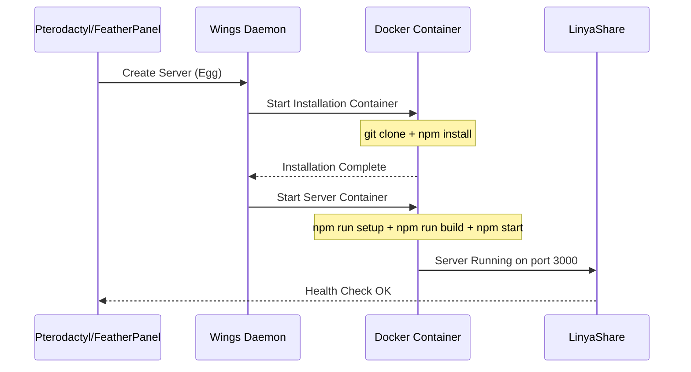

<div align="center">

# Pterodactyl / FeatherPanel Setup

> Deploy LinyaShare on Pterodactyl or FeatherPanel game panel.


</div>

---

## Navigation

| Document | Link |
|----------|------|
| Documentation Index | [docs/README.md](README.md) |
| Docker Setup | [SETUP_DOCKER.md](SETUP_DOCKER.md) |
| Node.js Setup | [SETUP_NODEJS.md](SETUP_NODEJS.md) |

---

## Table of Contents

1. [Critical: Wings PID Limit](#critical-wings-pid-limit)
2. [Deployment Flow](#deployment-flow)
3. [Egg Configuration](#egg-configuration)
4. [Egg File](#egg-file)
5. [Variables Reference](#variables-reference)
6. [Startup Command](#startup-command)
7. [Troubleshooting](#troubleshooting)

---

## Critical: Wings PID Limit

> [!CAUTION]
> Pterodactyl Wings has a default PID limit of **512**, which is too low for Next.js builds. You **must** increase this to at least **2048**.

### Why?

Next.js uses multiple worker processes during the build step (`npm run build`). With the default PID limit of 512, the build will fail with:

```
Error: Cannot fork
Error: Resource temporarily unavailable
```

### How to Fix

| Step | Action | Command |
|------|--------|---------|
| 1 | Edit Wings configuration | `nano /etc/featherpanel/config.yml` |
| 2 | Change PID limit | `containers.pids_limit: 2048` |
| 3 | Restart Wings | `systemctl restart wings` |
| 4 | Verify | `docker inspect <container> \| grep PidsLimit` |

Open `/etc/featherpanel/config.yml`:

```yaml
docker:
  network:
    container_pid_limit: 2048  # Change from 512 to 2048
```

> [!WARNING]
> If you skip this step, the server will fail during installation/build with cryptic fork/process errors. This is the most common issue when deploying Next.js apps on Pterodactyl.

---

## Deployment Flow



---

## Egg Configuration

### Docker Image

Use the official Node.js 22 yolk image:

```
ghcr.io/parkervcp/yolks:nodejs_22
```

### Docker Image Options

| Image | Source | Use Case |
|-------|--------|----------|
| `ghcr.io/parkervcp/yolks:nodejs_22` | Official ParkerVCP Yolks | Default |
| `ghcr.io/LinyaVT/linyashare:latest` | Custom build | Pre-built deployment |

### Startup Command

```bash
bash /home/container/start.sh
```

| Step | Command | Description |
|------|---------|-------------|
| 1 | `bash /home/container/start.sh` | Executes startup script with auto-update and dynamic IP/port handling |

### Stop Command

```
^C
```

---

## Egg File

> [!TIP]
> The egg configuration is available as a downloadable JSON file at the project root: [`egg-linyashare.json`](../egg/egg-linyashare.json)

### Import Instructions

| Step | Action |
|------|--------|
| 1 | Download [`egg-linyashare.json`](../egg/egg-linyashare.json) from the repository |
| 2 | Navigate to your Pterodactyl/FeatherPanel Admin Panel |
| 3 | Go to Nests > Create New Egg > Import Egg |
| 4 | Select the downloaded JSON file |
| 5 | Configure `NEXTAUTH_SECRET` and review the upload/proxy variables |

### GitHub Auto-Fetch

The egg installation script automatically fetches from GitHub:

| Variable | Default | Description |
|----------|---------|-------------|
| `GIT_REPO` | `https://github.com/LinyaVT/LinyaShare.git` | Repository URL (change for custom forks) |
| `GIT_BRANCH` | `main` | Branch to clone (e.g., `main`, `dev`) |
| `AUTO_UPDATE` | `false` | Enable to auto-pull updates on server restart |

Set a strong `NEXTAUTH_SECRET`. The upload-size and proxy settings have secure defaults and can be adjusted when required.

---

## Variables Reference

| Variable | Required | Default | Description |
|----------|----------|---------|-------------|
| `GIT_REPO` | Yes | `https://github.com/LinyaVT/LinyaShare.git` | GitHub repository URL |
| `GIT_BRANCH` | Yes | `main` | Branch to clone and track |
| `AUTO_UPDATE` | Yes | `false` | Automatically update from GitHub on restart |
| `NEXTAUTH_SECRET` | Yes | - | JWT encryption key |
| `NEXT_PUBLIC_APP_URL` | No | Auto-detected (`http://SERVER_IP:PORT`) | Public URL for share links (leave empty for auto) |
| `NEXTAUTH_URL` | No | Same as app URL | NextAuth callback URL |
| `AUTH_TRUST_HOST` | No | `true` | Allows auth when accessed via IP/hostname |
| `DATABASE_PROVIDER` | Yes | `sqlite` | Database backend: `sqlite`, `mysql`, or `postgres` |
| `DATABASE_URL` | No | Built-in SQLite database | Connection string for an external MySQL/MariaDB or PostgreSQL database |
| `MAX_UPLOAD_SIZE_BYTES` | Yes | `5368709120` | Maximum size of one authenticated upload in bytes (5 GiB by default) |
| `TRUSTED_PROXY` | Yes | `false` | Trust forwarded client IP headers only when the app is exclusively behind a trusted reverse proxy |

---

## Startup Command

| Scenario | How to Configure |
|----------|---------|
| Default | Everything is automatic - just start the server |
| With Auto-Update | Set `AUTO_UPDATE=true` in egg variables |
| Custom Branch | Set `GIT_BRANCH=dev` (or other branch) |
| Domain URL | Set `NEXT_PUBLIC_APP_URL=https://share.example.com` |
| Custom upload limit | Set `MAX_UPLOAD_SIZE_BYTES` to the desired byte limit |
| Trusted reverse proxy | Set `TRUSTED_PROXY=true` only when all traffic comes through the trusted proxy |

> [!NOTE]
> The startup script automatically handles setup and build steps. Auto-update will only rebuild if source files changed.

---

## Key Features

### 1. Automatic IP & Port Detection

The egg reads the server's port (`SERVER_PORT`) and IP (`SERVER_IP`) from the panel. It uses `export PORT=${SERVER_PORT:-{{SERVER_PORT}}}`, so it prefers an injected `SERVER_PORT` environment variable and falls back to the panel's `{{SERVER_PORT}}` template (which FeatherPanel/Pterodactyl substitutes before launch). The application therefore always listens on the server's allocation port. No hard-coded port, nothing to configure.

> [!TIP]
> On startup the script prints a debug line: `[startup] SERVER_PORT=... PORT=... NEXT_PUBLIC_APP_URL=...`.
> If `PORT=3000` or `PORT={{SERVER_PORT}}` appears, the panel is not providing the allocation port – check that the startup field still contains the `{{SERVER_PORT}}` template after saving.

- **Without domain**: Uses `http://SERVER_IP:PORT` automatically for share links
- **With domain**: Set `NEXT_PUBLIC_APP_URL=https://your-domain.com`

### 2. Branch Selection

You can specify which branch to use:

- **Stable**: Use `main` (default)
- **Development**: Use `dev` or other branches
- **Custom fork**: Change `GIT_REPO` and `GIT_BRANCH`

### 3. Auto-Update

Enable automatic updates on server restart:

- Set `AUTO_UPDATE=true`
- On restart, the script will:
  - Fetch and hard-reset the repository to the configured branch (`git fetch origin` + `git reset --hard origin/<branch>`), so local file conflicts can never abort the update
  - Update dependencies if `package.json` changed
  - Rebuild if source files changed

---

## Troubleshooting

| Symptom | Cause | Solution |
|---------|-------|----------|
| Build fails with `Cannot fork` | PID limit too low | Increase `pids_limit` to 2048 |
| `NEXTAUTH_SECRET not set` | Missing variable | Add secret in egg variables |
| `Port already in use` | Port conflict | Set custom port in server allocation settings |
| `Database does not exist` | Setup not run | Check startup command includes `npm run setup` |
| Login fails, log shows `CredentialsSignin` | Wrong credentials OR DB error | Wrong password → normal. If the log also shows `[auth][authorize] Unexpected error`, the Prisma engine is missing from the standalone build (see below) |
| `PrismaClientInitializationError` / DB errors after build | Prisma engine not copied to standalone | Already handled by the egg startup script (`cp -rf node_modules/.prisma .next/standalone/node_modules/`) |
| Installation fails | Git clone error | Check network/firewall settings |
| Server won't start | Build error | Check installation logs in panel |

### Checking Logs

| Step | Action |
|------|--------|
| 1 | Open your Pterodactyl/FeatherPanel admin panel |
| 2 | Navigate to the server |
| 3 | Click the Console tab |
| 4 | View real-time logs |

### Reinstalling

```
Server Settings > Reinstall Server
```

> [!WARNING]
> Reinstalling will delete all files in the server directory, including uploaded files and the database. Back up first.

### Manual Database Backup

```bash
# Via SFTP, download:
/home/container/prisma/linyashare.db

# Or via console:
cp /home/container/prisma/linyashare.db /home/container/prisma/linyashare.db.backup
```

---

<div align="center">

[Documentation Index](README.md) | [Docker Setup](SETUP_DOCKER.md) | [Node.js Setup](SETUP_NODEJS.md)

</div>
